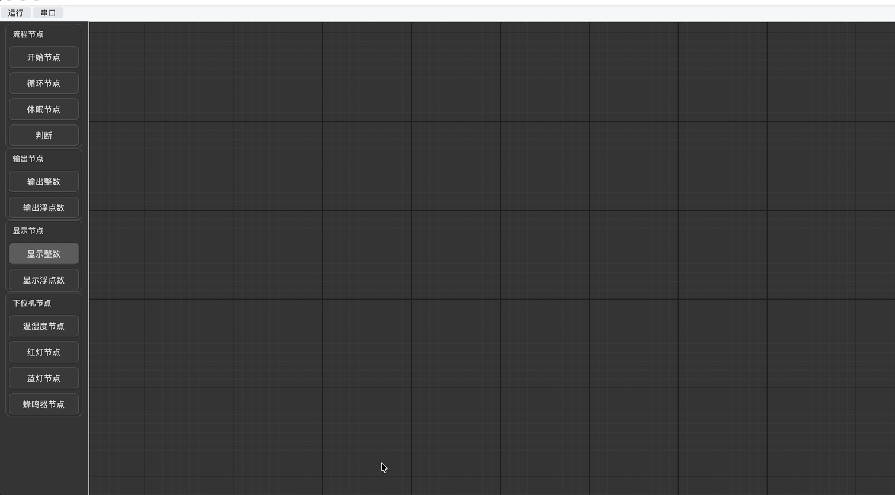
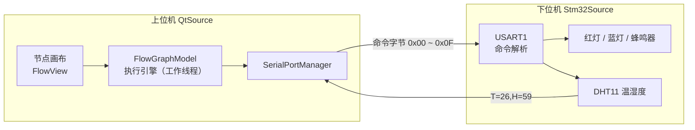
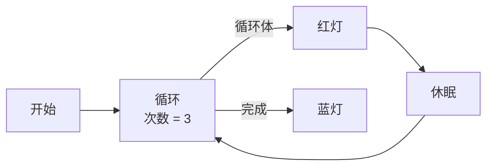

# 基于 Qt 的 STM32 可视化节点编程上位机

用**拖拽节点、连线**的方式给 STM32 下位机编程序 —— 把 C 代码里的控制流程（顺序、分支、循环、延时）变成一张可视化流程图，点击「运行」即由上位机解释执行，通过串口实时驱动下位机的外设并回读传感器数据。

`C++17` · `Qt 6 / 5` · `QtNodes` · `CMake` · `STM32F103` · `HAL` · `UART`

## 演示：读取下位机温湿度

下面这段录屏演示上位机运行流程图、通过「温湿度」节点向 STM32 下位机请求一次 DHT11 采样，并读回温度 / 湿度数据的完整过程：

<p align="center">
  
</p>

---

## 一、这是什么

传统 STM32 开发要写代码、编译、烧写。本项目把这件事变成**画图**：

1. 左侧面板拖出节点（开始 / 判断 / 循环 / 休眠 / 下位机控制…）；
2. 用连线把节点按执行顺序串起来，形成一张有向图；
3. 点「运行」，上位机按下位机通信协议逐节点解释执行；
4. 运行中的连接线变成**流动虚线**，可以直观看到执行到哪一步。

上位机与下位机是**两套独立工程**，通过串口字节协议解耦，本仓库同时包含两者。

---

## 二、功能特性

| 特性 | 说明 |
| --- | --- |
| 节点式流程编程 | 流程图即程序，支持顺序 / 分支 / 次数循环 / 延时 |
| 执行流 + 数据流双流模型 | 除“执行顺序”外，节点间还可传递整数、浮点、布尔、字符串 |
| 连接合法性校验 | 重写图模型的 `connectionPossible()`，端口类型不匹配无法连线 |
| 执行引擎与 UI 线程分离 | 流程解释执行在独立工作线程中运行，休眠 / 串口等待不阻塞界面 |
| 运行态可视化 | 运行时节点连接线切换为动态虚线样式；停止后恢复原样式 |
| 安全停机 | 从运行态切到停止态时自动下发 `0x00`，关闭下位机全部外设 |
| 状态驱动 | 只有处于运行态才接受有效数据与执行流，避免刚连线就被触发 |
| 依赖自带 | QtNodes 以**源码**形式内置于 `QtSource/third_party/`，无需预编译安装 |

---

## 三、节点清单

| 分类 | 节点 | 说明 |
| --- | --- | --- |
| 流程节点 | 开始节点 | 流程唯一入口，`main` 语义 |
| 流程节点 | 判断节点 | 按输入数值分流到「真」/「假」两条执行流 |
| 流程节点 | 循环节点 | 次数循环（内嵌次数输入框，0~100000） |
| 流程节点 | 休眠节点 | 延时，单位可由参数指定 |
| 输出节点 | 输出整数 / 输出浮点数 | 产出常量，接入下游数据端口 |
| 显示节点 | 显示整数 / 显示浮点数 | 面板上显示收到的数值，可接多个来源 |
| 下位机节点 | 红灯 / 蓝灯 / 蜂鸣器 | 通过串口控制对应外设通断 |
| 下位机节点 | 温湿度 | 请求一次 DHT11 采样并回读温度 / 湿度 |

所有节点均带**执行流输入 / 输出端口**，因此可以像搭积木一样自由串联执行顺序。

---

## 四、系统架构



- **下行**：上位机每个字节都是一次“全量状态设置”，低 4 位分别控制红灯 / 蓝灯 / 蜂鸣器 / 是否回发温湿度。
- **上行**：下位机仅在被请求时回发一行 ASCII 文本，串口其余时间保持静默。

---

## 五、项目结构

```
QT上位机可视化节点编辑器控制STM32下位机/
├── README.md                  # 本文件
├── docs/images/               # 演示图（本 README 引用）
├── QtSource/                  # 上位机（Qt 桌面程序）
│   ├── src/
│   │   ├── core/              # 数据载体、图模型与执行引擎、串口管理
│   │   ├── nodes/             # 各类节点模型实现
│   │   └── ui/                # 主窗口、视图、节点面板与连线绘制
│   ├── third_party/nodeeditor/ # QtNodes 源码（MIT）
│   └── CMakeLists.txt
└── Stm32Source/               # 下位机（STM32F103C8T6 固件）
    ├── Core/                  # 主程序与外设初始化
    ├── Drivers/               # HAL 库与 CMSIS
    ├── EWARM/                 # IAR 工程文件
    ├── Makefile               # arm-none-eabi 构建脚本
    ├── 上位机通信协议.md        # 串口协议完整说明
    └── 开发踩坑与烧写教程.md    # 烧写与调试记录
```

---

## 六、环境依赖

**上位机**

- Qt 6（`Widgets`、`SerialPort` 模块）；CMake 已同时兼容 Qt 5
- CMake ≥ 3.16
- 支持 C++17 的编译器（MSVC / GCC / Clang 均可）

**下位机**

- `arm-none-eabi-gcc` + `make`（Makefile 路径）
- 或 IAR EWARM（`EWARM/` 工程路径）
- 硬件：STM32F103C8T6 开发板、DHT11、USB-TTL 转接

---

## 七、构建与运行

### 上位机

```bash
cd QtSource
cmake -S . -B build -DCMAKE_BUILD_TYPE=Release
cmake --build build -j
```

生成的程序为 `build/bishe`（macOS 下为 `build/bishe.app`）。启动后即可拖拽节点搭流程图，运行前需在界面中选择下位机对应的串口。

### 下位机

```bash
cd Stm32Source
make -j
```

烧写方式与踩坑记录见 [`Stm32Source/开发踩坑与烧写教程.md`](Stm32Source/开发踩坑与烧写教程.md)。

---

## 八、串口协议速查

串口参数：**115200 · 8 · N · 1**，USART1（PA9 = TX，PA10 = RX），USB-TTL 须与开发板**共地**。

**下行命令字节**（只有低 4 位有效，每位都是「全量设置」）

| 位 | 掩码 | 外设 | 1 | 0 |
| --- | --- | --- | --- | --- |
| bit0 | `0x01` | 红灯（PA7） | 点亮 | 熄灭 |
| bit1 | `0x02` | 蓝灯（PA6） | 点亮 | 熄灭 |
| bit2 | `0x04` | 蜂鸣器（PA5） | 响 | 不响 |
| bit3 | `0x08` | 温湿度上报 | 回发一次 | 不回发 |

**常用取值**

| 发送 | 效果 |
| --- | --- |
| `0x00` | 全部关闭（停机时上位机自动下发） |
| `0x01` / `0x02` / `0x04` | 红灯亮 / 蓝灯亮 / 蜂鸣器响 |
| `0x07` | 三路全开 |
| `0x09` / `0x0A` | 红灯亮 / 蓝灯亮，并回发温湿度 |

**上行数据**

| 场景 | 内容 |
| --- | --- |
| 上电就绪 | `DHT11 init ok` 或 `DHT11 init fail` |
| 温湿度回发 | `T=26,H=59`，失败时 `T=ERR,H=ERR` |

> 上行必须**按行（`\n`）解析**，不能按固定长度读取。完整协议见 [`Stm32Source/上位机通信协议.md`](Stm32Source/上位机通信协议.md)。

---

## 九、示例：闪灯 3 次

在画布上搭出下面这张图，即可让红灯闪烁 3 次后点亮蓝灯：



要点：循环体的末端必须**接回循环节点的「循环」输入端口**，否则只会执行一轮且不会输出「完成」。

---

## 十、文档索引

| 文档 | 内容 |
| --- | --- |
| [`Stm32Source/上位机通信协议.md`](Stm32Source/上位机通信协议.md) | 串口协议完整定义、时序约束、Python 示例代码 |
| [`Stm32Source/开发踩坑与烧写教程.md`](Stm32Source/开发踩坑与烧写教程.md) | 烧写流程与开发过程中遇到的问题记录 |

---

## 十一、第三方组件

本项目内嵌 [QtNodes](https://github.com/paceholder/nodeeditor)（节点编辑器框架），遵循 **MIT** 许可，许可证文本见 [`QtSource/third_party/nodeeditor/LICENSE.rst`](QtSource/third_party/nodeeditor/LICENSE.rst)。